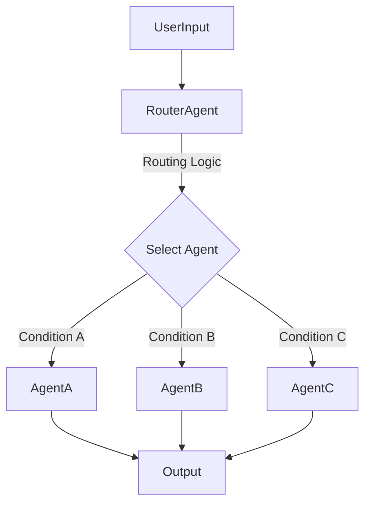
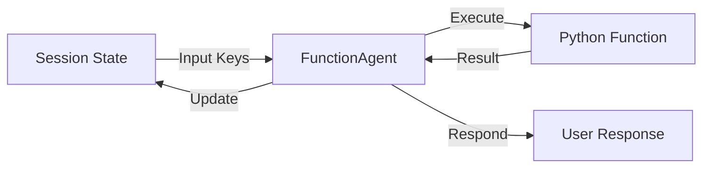
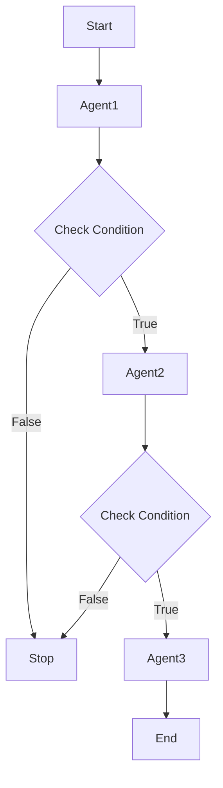

# Custom Agent Patterns for Google ADK

This repository contains custom agent patterns for the Google Agent Development Kit (ADK). Each pattern demonstrates a specific way to structure and control agent interactions.

## 1. Router Agent Pattern
**Location:** `router_agent_pattern/`

The **Router Agent** dynamically selects exactly one sub-agent to execute based on a routing function. This is useful for building intent-based routers or branching logic where only one path should be taken.



## 2. Function Agent Pattern
**Location:** `function_agent_pattern/`

The **Function Agent** wraps a deterministic Python function into an agent. It maps session state keys to function arguments, executes the function, and stores the result in the state. Ideal for deterministic tools, data processing, or API calls.



## 3. Conditional Sequential Agent Pattern
**Location:** `conditional_sequential_pattern/`

The **Conditional Sequential Agent** runs a list of sub-agents in order, but checks a condition after each step. If the condition fails (returns `False`), the sequence stops immediately. This is powerful for validation pipelines, early-exit strategies, or dependent workflows.



## Getting Started

1.  **Install Dependencies:**
    ```bash
    pip install -r requirements.txt
    ```

2.  **Run Tests:**
    Each pattern includes a test suite.
    ```bash
    python -m router_agent_pattern.test_agent
    python -m function_agent_pattern.test_agent
    python -m conditional_sequential_pattern.test_agent
    ```

3.  **Usage Examples:**
    Check the `usage_example.py` in each directory for runnable code snippets.

---

## Disclaimer

These are code samples and may need to be updated to run in production. There is no guarantee that they will work in all environments or configurations without modification.

